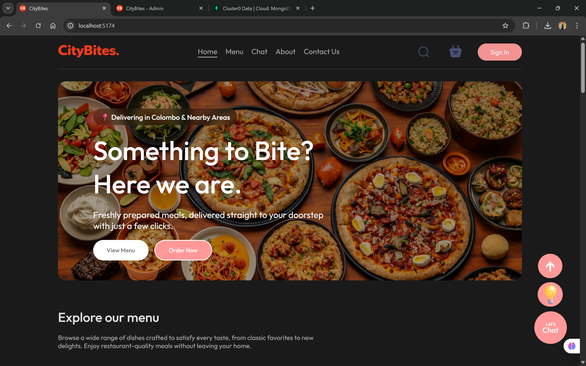

## 🍔 CityBites – Urban Food Delivery Platform

   
  
   
  

    
    
    
    
    
    
    
    
    
    
    

  

  <h3 align="center">CityBites is built using modern web technologies such as React for responsive user interfaces, Express.js for backend services, and MongoDB for scalable data management in urban food consumption systems.</h3>
  

    Follow and Connect with me on  
    <a href="https://www.linkedin.com/in/dulaj-dulsith-a7093a27a/" target="_blank"><b>LinkedIn</b></a>
  

   

CityBites is a comprehensive food delivery application designed to simplify urban food experiences. It connects users with restaurants through a centralized platform, catering to the growing demand for fast and reliable on-demand services
The platform combines e-commerce functionality with real-time communication and community features, enabling informed purchasing decisions while enhancing customer–restaurant interaction.

### 🚀 Key Features
👤 User-Side Features

- Secure user authentication
- Registration, login, and password recovery
- Email verification codes for account security
- Organized food browsing with categorized listings
- Shopping cart with persistent storage across sessions
- End-to-end order placement with Stripe payment integration
- Real-time order status tracking with automated email notifications
- Product ratings and feedback system
- 1–5 star ratings with comments
- Duplicate review prevention logic
- User profile management with password change functionality
- Live customer chat powered by Socket.io

 🛠️ Admin Panel Features

- Complete food catalog management (Create, Read, Update, Delete)
- Order monitoring and management
- Centralized control over menus and system operations

 🧱 System Architecture Overview

- Frontend: React + Vite (Customer app & Admin panel)
- Backend: Node.js + Express.js (RESTful API)
- Database: MongoDB with indexing for performance
- Payments: Stripe
- Real-time Communication: Socket.io
- Email Services: Nodemailer
- Authentication: JWT with bcrypt password hashing
- Containerization: Docker & Docker Compose
- CI/CD: GitHub Actions

### ✅ What Worked Well
Core Features

- Robust user authentication system with email verification
- Real-time chat functionality using Socket.io
- Full food catalog CRUD operations via admin panel
- Persistent shopping cart across user sessions
- Secure payment workflow with Stripe integration
- Real-time order tracking with email notifications
- Reliable product rating and review system
- Comprehensive user profile managemen

Infrastructure

- Docker containerization with health checks across 6 services
- GitHub Actions CI/CD pipeline with automated testing
- MongoDB persistence with proper indexing strategies
- Secure JWT-based authentication and password hashing
- Automated email notifications for critical user actions

### 🧪 Usefulness of Techniques
1. Unit Testing (High Value)
Unit testing was highly effective in detecting validation and logic errors at early development stages. However, heavy reliance on mocks resulted in some real integration issues being discovered later.

2. Integration Testing (Medium–High Value)
Integration testing successfully validated real user flows and API contracts. Its effectiveness was limited by the absence of a fully production-like database environment.

3. Manual Usability Testing (High Value)
Manual usability testing revealed real user experience issues early, enabling rapid and impactful improvements to UI/UX design.

4. CI/CD Pipeline (High Value)
Automated testing and branch protection ensured strong code quality and development discipline, despite occasional false failures due to strict execution time limits.

🧰 Usefulness of Technologies
1. Node.js + Express.js
Enabled rapid API development and scalability. Long-term maintainability would benefit from adopting TypeScript.

2. React + Vite
Provided an excellent developer experience with fast builds and easy prototyping. Larger applications would require more advanced state management solutions.

3. MongoDB
Offered flexibility and rapid development, but the lack of strict relational constraints may limit suitability for complex production systems.

4. Docker & Docker Compose
Ensured consistent development environments and reliable service orchestration. Production performance could be improved using multi-stage Docker builds.

5. GitHub Actions
Delivered a cost-effective and well-integrated CI solution for testing and secrets management, though scalability and artifact handling are limited on the free tier.

### 📌 Conclusion

CityBites successfully demonstrates a scalable, real-time, full-stack food delivery platform that integrates modern web technologies, secure payment processing, and strong DevOps practices. The project highlights both the strengths and practical limitations of the chosen tools and techniques, providing a solid foundation for future enhancements and production readiness.
